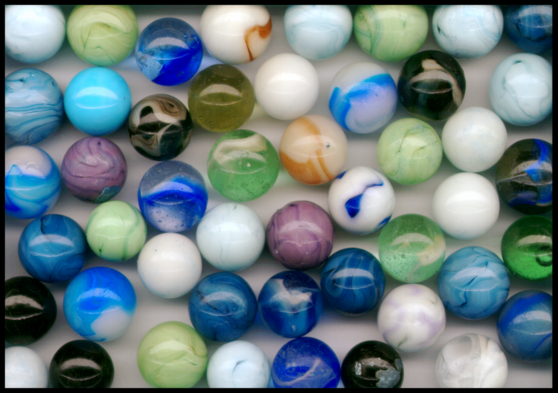
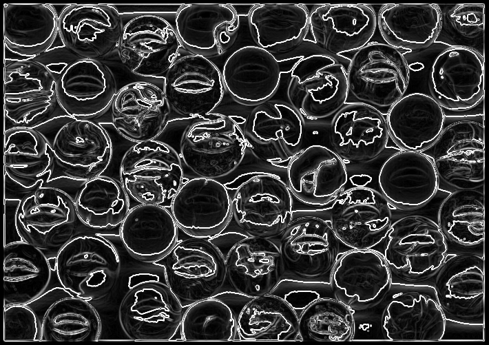
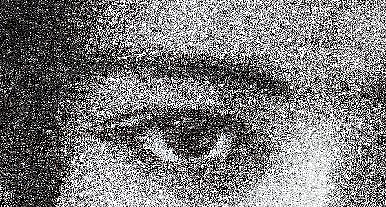
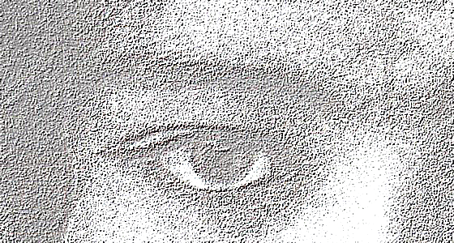
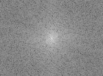

# Convolution Tutorial {#convolution_tutorial}

This demo teaches Image::convolve() (and gaussian_blur(), which is built on it) the same way demo/multiview teaches view()/slice(): each step shows the code, explains it, and shows the result -- first on small numbers you can check by hand, then on a real photo whose results you check by *looking at the saved PNG*. Output PNGs land in: /home/nathanpackard/git/ndl/build/demo/convolution/output

## PART 1: how convolve() works

### Step 1
```cpp
Image<int,2> grid(data, {5,5});  ... fill 1..25
```

A plain 5x5 grid, x fastest. convolve() computes one output value per input position from a small neighborhood around it, so this grid is the shared input for every step in Part 1.

```text
    grid:
 1.00,  2.00,  3.00,  4.00,  5.00, 
 6.00,  7.00,  8.00,  9.00, 10.00, 
11.00, 12.00, 13.00, 14.00, 15.00, 
16.00, 17.00, 18.00, 19.00, 20.00, 
21.00, 22.00, 23.00, 24.00, 25.00, 
```

### Step 2
```cpp
grid.convolve(identityKernel, out1)
```

convolve(kernel, output) centers `kernel` on every position of *this in turn, multiplies each kernel weight by the input value under it, and sums: output(coord) = sum over kernel taps of kernel(k) * input(coord + k - center). A kernel that's 1 at its own center and 0 everywhere else reproduces exactly the value already there -- convolving with it is a no-op, the simplest possible check that the machinery above does what it says.

```text
    identityKernel:
0.00, 0.00, 0.00, 
0.00, 1.00, 0.00, 
0.00, 0.00, 0.00, 
```

```text
    out1 (should equal grid):
 1.00,  2.00,  3.00,  4.00,  5.00, 
 6.00,  7.00,  8.00,  9.00, 10.00, 
11.00, 12.00, 13.00, 14.00, 15.00, 
16.00, 17.00, 18.00, 19.00, 20.00, 
21.00, 22.00, 23.00, 24.00, 25.00, 
```

### Step 3
```cpp
grid.convolve(sumKernel, out2)   // sumKernel is 3x3, all 1s
```

Every weight is 1, so each output value is just the SUM of the 3x3 neighborhood around it. For an INTERIOR position like (2,2), every tap is a real, in-bounds grid element: reading straight off the grid above (row y=1 gives x=1..3 -> 7,8,9; row y=2 -> 12,13,14; row y=3 -> 17,18,19), out2(2,2) = 7+8+9 + 12+13+14 + 17+18+19 = 117. For a CORNER like (0,0), some of the 3x3's taps (x,y in {-1,0,1}x{-1,0,1}) fall outside the grid entirely -- this call passes no BorderMode, so it uses convolve()'s default, BorderMode::Clamp, which substitutes the nearest in-bounds pixel for any out-of-bounds one (so both x=-1 and y=-1 become 0). The breakdown printed below spells out exactly which 9 grid values that produces and what they sum to -- read it alongside out2(0,0) to see the same 27 land in both places.

```text
    sumKernel:
1.00, 1.00, 1.00, 
1.00, 1.00, 1.00, 
1.00, 1.00, 1.00, 
```

```text
    out2:
 27.00,  33.00,  42.00,  51.00,  57.00, 
 57.00,  63.00,  72.00,  81.00,  87.00, 
102.00, 108.00, 117.00, 126.00, 132.00, 
147.00, 153.00, 162.00, 171.00, 177.00, 
177.00, 183.00, 192.00, 201.00, 207.00, 
```

```text
out2(2,2):   117  (expected 117, interior -- see explanation)
out2(0,0) breakdown (default border = Clamp):   1+1+2 + 1+1+2 + 6+6+7 = 27
out2(0,0):   27  (should match the breakdown above)
```

### Step 4
```cpp
grid.convolve(sumKernel, out2, BorderMode::Clamp / Wrap / Reflect)
```

Redoing that same corner, out2(0,0), under all three border modes -- the breakdowns below are built from the exact same _clamp()/_wrap()/_reflect() functions convolve() itself calls (mathHelpers.h), so they're a real trace of the computation, not a paraphrase of it. Clamp repeats the nearest in-bounds pixel for an out-of-bounds tap (x=-1 -> 0, y=-1 -> 0). Wrap treats the 5-wide/5-tall grid as periodic, so x=-1/y=-1 wrap to the OPPOSITE edge (index 4), pulling in row/column 4's much larger values instead -- that's why Wrap's total (99) is so much bigger than Clamp's (27). Reflect mirrors a tap back into the grid using -x-1 (so x=-1 -> 0 too, same as Clamp) -- for THIS specific case (a radius-1 kernel, so the only out-of-bounds offset that ever occurs is -1) Clamp and Reflect are mathematically guaranteed to agree, which is why both read 27 below; they'd diverge for a wider kernel whose taps reach 2+ steps out of bounds (there, Reflect mirrors past the edge instead of repeating it).

```text
out2(0,0) breakdown with Clamp:   1+1+2 + 1+1+2 + 6+6+7 = 27
out2(0,0) breakdown with Wrap:   25+21+22 + 5+1+2 + 10+6+7 = 99
out2(0,0) breakdown with Reflect:   1+1+2 + 1+1+2 + 6+6+7 = 27
out2(0,0) with Clamp:   27  (should match the Clamp breakdown above)
out2(0,0) with Wrap:   99  (should match the Wrap breakdown above)
out2(0,0) with Reflect:   27  (should match the Reflect breakdown above)
```

## PART 2: a real photo, box blur

```text
Opening the input file: /home/nathanpackard/git/ndl/demo/convolution/../../unitTests/data/ng_bwgirl_crop.jpg.
width: 560
height: 300
width * height: 168000
size: 504000
```

### Step 5
```cpp
image_io::load("ng_bwgirl_crop.jpg", extent)
```

A real photo: extent {channel, x, y}, channel-interleaved, loaded exactly like every other image_io-supported format. Saved right back out unmodified first, so you have an unblurred reference to compare every later step against.


```text
photo: /home/nathanpackard/git/ndl/build/demo/convolution/output/01_original.png
    extent = {3, 560, 300}   min=0  max=255  mean=121.08
```

### Step 6
```cpp
convolveColor(photo, boxKernel, boxBlurred, BorderMode::Clamp)   // boxKernel is 3x3, all 1/9
```

The exact same sumKernel idea from Part 1, just normalized (weights sum to 1 instead of 9) so brightness is preserved instead of tripled, applied one color channel at a time -- convolveColor() slices off red/green/blue and convolves each separately, so colors don't bleed into each other. A small, mild blur.


```text
box-blurred photo: /home/nathanpackard/git/ndl/build/demo/convolution/output/02_box_blur.png
    extent = {3, 560, 300}   min=20  max=239  mean=120.59
```

## PART 3: gaussian_blur()

### Step 7
```cpp
impulse.gaussian_blur(1.0, response)   // impulse is all 0 except one center pixel
```

Convolution has a classic way to *see* a kernel: feed it an image that's all zero except one pixel, and the output at every position is just that kernel's own weight there (multiplying a single value by each weight and summing changes nothing else). Image::gaussian_blur(sigma, output) builds a Gaussian-weighted kernel sized by sigma (radius = ceil(3*sigma), so sigma=1.0 gives a 7x7 kernel here) and calls convolve() with it -- so blurring a single bright dot traces out that kernel's actual shape, printed below as numbers.

```text
  response (the Gaussian kernel's own shape, scaled by 1000):
0.00,   0.00,   0.00,   0.00,   0.00,   0.00,   0.00,   0.00,   0.00,   0.00,   0.00, 
0.00,   0.00,   0.00,   0.00,   0.00,   0.00,   0.00,   0.00,   0.00,   0.00,   0.00, 
0.00,   0.00,   0.02,   0.24,   1.07,   1.77,   1.07,   0.24,   0.02,   0.00,   0.00, 
0.00,   0.00,   0.24,   2.92,  13.07,  21.55,  13.07,   2.92,   0.24,   0.00,   0.00, 
0.00,   0.00,   1.07,  13.07,  58.58,  96.58,  58.58,  13.07,   1.07,   0.00,   0.00, 
0.00,   0.00,   1.77,  21.55,  96.58, 159.24,  96.58,  21.55,   1.77,   0.00,   0.00, 
0.00,   0.00,   1.07,  13.07,  58.58,  96.58,  58.58,  13.07,   1.07,   0.00,   0.00, 
0.00,   0.00,   0.24,   2.92,  13.07,  21.55,  13.07,   2.92,   0.24,   0.00,   0.00, 
0.00,   0.00,   0.02,   0.24,   1.07,   1.77,   1.07,   0.24,   0.02,   0.00,   0.00, 
0.00,   0.00,   0.00,   0.00,   0.00,   0.00,   0.00,   0.00,   0.00,   0.00,   0.00, 
0.00,   0.00,   0.00,   0.00,   0.00,   0.00,   0.00,   0.00,   0.00,   0.00,   0.00, 
```

### Step 8
```cpp
gaussianBlurColor(photo, 2.0, gauss1, BorderMode::Clamp)
```

The same gaussian_blur() call, on the real photo, per channel. sigma=2.0 gives a wider, softer blur than Part 2's 3x3 box -- compare 02_box_blur.png and 03_gaussian_sigma2.png side by side.


```text
gaussian-blurred (sigma=2.0): /home/nathanpackard/git/ndl/build/demo/convolution/output/03_gaussian_sigma2.png
    extent = {3, 560, 300}   min=27  max=232  mean=120.57
```

### Step 9
```cpp
gaussianBlurColor(photo, 6.0, gauss2, BorderMode::Clamp)
```

A much larger sigma -- the radius grows with it too (ceil(3*6.0)=18, a 37x37 kernel), so this is a heavy blur, the kind used to approximate depth-of-field or to build an image pyramid.


```text
gaussian-blurred (sigma=6.0): /home/nathanpackard/git/ndl/build/demo/convolution/output/04_gaussian_sigma6.png
    extent = {3, 560, 300}   min=31  max=229  mean=120.56
```

## PART 4: edge detection (Sobel)

### Step 10
```cpp
image_io::load("marbles.bmp", extent); downsampleColor(marblesRaw, 2)
```

The start image for this Part and the frequency-domain Part 6 below -- saved on its own, same as photo was in Part 2, so 06_sobel_edges.png further down has an unmodified 'before' to be compared against instead of only showing the 'after'. Downsampled 2x from the raw file (see downsampleColor() above main()) purely to keep this demo's saved images (and the docs generated from them) a reasonable size -- unrelated to convolve() or Sobel themselves.



```text
marbles: /home/nathanpackard/git/ndl/build/demo/convolution/output/05_marbles_original.png
    extent = {3, 710, 501}   min=0  max=254  mean=120.81
```

### Step 11
```cpp
marbles.mean(0, grey3)   // per-axis reduction over the channel axis
```

Sobel below looks for brightness change, not color, so marbles.bmp is reduced to greyscale first -- reusing Image::mean(axis, output) from the reductions work rather than writing a separate greyscale routine: averaging over axis 0 (channel) collapses R,G,B down to one value per pixel, written into a same-rank output with extent 1 along that axis.

```text
greyU8:   extent {710, 501}, single channel
```

### Step 12
```cpp
grey.convolve(sobelX, gx, BorderMode::Reflect); grey.convolve(sobelY, gy, BorderMode::Reflect)
```

Two more 3x3 kernels -- proof convolve() takes any weights, not just symmetric blur-style ones. sobelX responds to horizontal brightness change (vertical edges), sobelY to vertical change (horizontal edges); a flat region gives 0 from both, which is why this runs on double-precision grey rather than uint8_t -- the results are signed.

```text
    sobelX:
-1.00,  0.00,  1.00, 
-2.00,  0.00,  2.00, 
-1.00,  0.00,  1.00, 
```

```text
    sobelY:
-1.00, -2.00, -1.00, 
 0.00,  0.00,  0.00, 
 1.00,  2.00,  1.00, 
```

### Step 13
```cpp
gx.multiply(gx, gx2); gy.multiply(gy, gy2); gx2.add(gy2, magSq); then sqrt() elementwise
```

Gradient magnitude is sqrt(gx^2 + gy^2) -- built here from the non-mutating arithmetic methods (multiply/add) added alongside convolve(), rather than a hand-written loop, then a sqrt+clamp pass (toDisplayable) converts back to a displayable 8-bit image, saved as a single-channel (greyscale) PNG.



```text
Sobel edge magnitude: /home/nathanpackard/git/ndl/build/demo/convolution/output/06_sobel_edges.png
    extent = {1, 710, 501}   min=0  max=255  mean=55.54
```

## PART 5: arbitrary kernels

### Step 14
```cpp
convolveColorSafe(photo, sharpenKernel, sharpened, BorderMode::Reflect)
```

convolve() places no restriction on kernel weights -- here center=5, neighbors=-1, weights still summing to 1 like the blur kernels, but the negative neighbors subtract off nearby brightness, which *increases* local contrast at edges instead of smoothing it out. Sharpening can genuinely overshoot below 0 or above 255 at strong edges, which is exactly the case convolveColorSafe() (double intermediate + explicit clamp) exists for, instead of convolve()'s own uint8_t output path.

```text
    sharpenKernel:
 0.00, -1.00,  0.00, 
-1.00,  5.00, -1.00, 
 0.00, -1.00,  0.00, 
```



```text
sharpened photo: /home/nathanpackard/git/ndl/build/demo/convolution/output/07_sharpen.png
    extent = {3, 560, 300}   min=0  max=255  mean=122.49
```

### Step 15
```cpp
convolveColorSafe(photo, embossKernel, embossed, BorderMode::Reflect, 128.0)
```

An asymmetric kernel: it responds to change along one diagonal and is flat along the other, so flat regions of the photo collapse toward 0 (black) rather than toward their own brightness. The usual fix -- applied here via toDisplayable()'s bias argument -- is to add 128 back so 'no change' lands on mid-grey instead of black.

```text
    embossKernel:
-2.00, -1.00,  0.00, 
-1.00,  1.00,  1.00, 
 0.00,  1.00,  2.00, 
```



```text
embossed photo: /home/nathanpackard/git/ndl/build/demo/convolution/output/08_emboss.png
    extent = {3, 560, 300}   min=0  max=255  mean=190.91
```

## PART 6: the frequency domain

### Step 16
```cpp
Image<uint8_t,3> crop = marbles.view({0,290,186}, {2,439,297});   // 150x112, all 3 channels -- deliberately NOT a power of two
```

fftn() used to require every dimension's extent to be an exact power of two; it no longer does -- fftn()/ifftn() now handle ANY extent, via Bluestein's algorithm (the chirp-z transform; see FFTBluestein in fft.h) for whichever axes aren't already a power of two. This crop is still here, but for two much more mundane reasons: keeping this demo's pixel-by-pixel comparison and the timing benchmark below fast, and keeping the log-magnitude spectrum image a comfortable size to look at -- not because fftn() needs it. To prove that, this crop is deliberately 150x112: NOT a power of two in either dimension (128x128 would have been). marbles rather than photo on purpose here, same reason Part 4 switched to it for Sobel: photo's real film-grain noise spreads energy across every frequency roughly evenly, which swamps the log-magnitude spectrum below into near-uniform static rather than showing readable structure -- marbles' cleaner per-pixel contrast doesn't have that problem. Every step below works on this crop.


```text
crop: /home/nathanpackard/git/ndl/build/demo/convolution/output/09_crop.png
    extent = {3, 150, 112}   min=18  max=254  mean=141.32
```

### Step 17
```cpp
fftn<double,2>(greyCropDbl, freq)   // greyscale, so there's one spectrum to look at, not three
```

The magnitude of each complex output value says how much of that frequency is present in the crop -- low frequencies (slow brightness changes, like the overall lighting) near the corners of the raw output, high frequencies (sharp edges, fine texture) further out. Displaying that directly is unreadable: fftshift() below recenters it (a numpy.fft convention -- DC in the middle, not the corner) and a log(1+magnitude) scale tames its enormous dynamic range (the DC term alone is the sum of every one of the crop's 16800 pixels) so faint high-frequency detail doesn't just disappear next to it.



```text
log-magnitude spectrum (fftshifted): /home/nathanpackard/git/ndl/build/demo/convolution/output/10_spectrum.png
    extent = {1, 150, 112}   min=51  max=255  mean=136.23
```

### Step 18
```cpp
fftCorrelateColor(crop, box5Kernel, fftBoxBlurred)   // 5x5 box kernel -- a bit stronger than the 3x3 one from Part 2
// fftCorrelateColor() itself does exactly this, per color channel:
fftn<double,2>(kernelPadded, kernelFreq);          // kernel -> its own spectrum (computed once, shared by every channel)
fftn<double,2>(channelAsDouble, imgFreq);          // this channel -> its own spectrum
product = conj(kernelFreq) * imgFreq;              // per-frequency multiply -- this IS the convolution
ifftn<double,2>(product, blurredChannel);          // spectrum -> back to pixels
```

The crop shown again just above is this comparison's starting point. fftCorrelateColor() takes each channel to the frequency domain, multiplies by the kernel's spectrum (conjugated -- convolve() computes a correlation, not a textbook convolution; see the comment on fftCorrelateColor() in this file, or testFFTMatchesSpatialConvolution in unitTests.cpp, for the exact identity and why), and transforms back -- the 5 lines above are that function's real body, not a paraphrase of it. That's a real, independent computation of the *same* answer Part 2's convolveColor(crop, box5Kernel, ..., BorderMode::Wrap) would give -- computed below for direct comparison rather than taken on faith.


```text
crop (this comparison's starting point, shown again for convenience): /home/nathanpackard/git/ndl/build/demo/convolution/output/09_crop.png
    extent = {3, 150, 112}   min=18  max=254  mean=141.32
```


```text
FFT-domain box blur: /home/nathanpackard/git/ndl/build/demo/convolution/output/11_fft_box_blur.png
    extent = {3, 150, 112}   min=25  max=254  mean=140.82
```


```text
spatial-domain box blur (BorderMode::Wrap, for a fair comparison): /home/nathanpackard/git/ndl/build/demo/convolution/output/12_spatial_box_blur_wrap.png
    extent = {3, 150, 112}   min=25  max=253  mean=140.83
largest per-pixel difference between the two:   1 (out of 0-255) -- 11 and 12 should look identical
```

### Step 19
```cpp
timing: spatial convolve() vs FFT correlation, at two very different kernel sizes
```

convolve()'s cost scales with image size TIMES kernel size (every output pixel visits every kernel tap); fftn()'s cost scales with image size alone (kernel size only changes how the kernel gets *built*, not the transform cost) -- so which one wins depends entirely on the kernel. A 3x3 kernel is 9 taps; the 5x5 one already used above for the visual comparison is 25, ~2.8x more spatial work for the exact same image, while the FFT side barely changes (same 7 image-sized transforms either way -- 1 for the kernel, 2 per channel). Averaged over a few repetitions below.

```text
3x3 kernel  -- spatial convolve():   2.305771 ms/call
3x3 kernel  -- FFT correlation:   5.216178 ms/call
5x5 kernel -- spatial convolve():   6.341619 ms/call
5x5 kernel -- FFT correlation:   5.186499 ms/call
```

All outputs written to: /home/nathanpackard/git/ndl/build/demo/convolution/output Open 01_original.png alongside the rest to compare by eye: 02/03/04 should look progressively softer. 06 should show bright edges on a dark background -- compare it to 05, marbles' own unmodified original. 07 should look crisper than the original, and 08 should look like a grey relief carving. 10 is what the 150x112 crop (09) looks like in the frequency domain -- a bright center fading outward, with any strong directional texture in the crop showing up as streaks through it. 11 and 12 should be visually indistinguishable -- a 5-pixel box blur, computed two independent ways (frequency domain and spatial domain), that agree to within a pixel or two of rounding.

