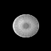
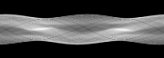
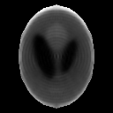
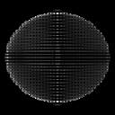

# 3D Cone-Beam CT Reconstruction Tutorial {#ct_reconstruction_3d_tutorial}

This demo is the 3D, cone/fan-beam sibling of demo/ct_reconstruction (2D parallel-beam) -- same forward_project()/back_project() (projection.h), a genuinely perspective geometry this time. It's considerably slower than a 2D demo (64^3 volume, ~740k cone-beam rays per pass) -- expect roughly a minute and a half end to end, mostly PART 5's continuous reconstruction loop and PART 6's DART refinement on top of it. Output PNGs land in: /home/nathanpackard/git/ndl/build/demo/ct_reconstruction_3d/output

## PART 1: cone-beam geometry -- a single voxel, checked by hand

### Step 1
```cpp
forward_project(singleVoxel, sino1, geometry1)   // one voxel at the cone's own center of rotation
```

Unlike an off-center voxel, a voxel exactly on the source-to-detector axis lands at the SAME detector pixel (the detector's own center) at every view angle regardless of the geometry being a true perspective (cone-beam) projection -- the one case simple enough to check without a calculator, and a real test of the (detW/2,detH/2) recentering math (see buildConeBeamGeometry()'s own comment).

```text
view 0 peak detector pixel (expect (4,4)):   (4,4)  value=0.987654
view 1 peak detector pixel (expect (4,4)):   (4,4)  value=1.000000
view 2 peak detector pixel (expect (4,4)):   (4,4)  value=1.000000
view 3 peak detector pixel (expect (4,4)):   (4,4)  value=1.000000
```

## PART 2: the 3D Shepp-Logan phantom (64^3)

### Step 2
```cpp
sheppLoganValue3D(x,y,z)   // ten ellipsoids, additive density
```

The classic Shepp-Logan phantom, extended to a solid (Kak & Slaney) -- an idealized 3D head volume built from ten overlapping ellipsoids, evaluated directly onto a 64^3 grid (see PART 3's own comment for why 64^3 is the right match for this detector's own resolving power). Three orthogonal central slices are saved below (axial/coronal/sagittal) since a whole volume can't be viewed as one PNG.

[](images/ct_reconstruction_3d_tutorial/ct_reconstruction_3d_tutorial_01_phantom_axial.png)

```text
phantom, axial slice (z=64): /home/nathanpackard/git/ndl/build/demo/ct_reconstruction_3d/output/01_phantom_axial.png
    extent = {64, 64}   min=0  max=255  mean=30.5547
```

[](images/ct_reconstruction_3d_tutorial/ct_reconstruction_3d_tutorial_02_phantom_coronal.png)

```text
phantom, coronal slice (y=64): /home/nathanpackard/git/ndl/build/demo/ct_reconstruction_3d/output/02_phantom_coronal.png
    extent = {64, 64}   min=0  max=255  mean=24.7119
```

[](images/ct_reconstruction_3d_tutorial/ct_reconstruction_3d_tutorial_03_phantom_sagittal.png)

```text
phantom, sagittal slice (x=64): /home/nathanpackard/git/ndl/build/demo/ct_reconstruction_3d/output/03_phantom_sagittal.png
    extent = {64, 64}   min=0  max=255  mean=40.2671
```

## PART 3: forward_project() the phantom through a 64x64-detector cone-beam geometry

### Step 3
```cpp
forward_project(phantom, sinogram, geometry)   // 180 cone-beam views over 360 degrees
```

Each of the 180 saved views is a full 64x64 cone-beam projection image (not a single 1D row, unlike the 2D demo's sinogram) -- 04_projection_view0.png shows one representative view; 05_sinogram_slice.png shows the classic sinogram layout (view angle x detector row) for just the detector's own central row, across all 180 views.

[](images/ct_reconstruction_3d_tutorial/ct_reconstruction_3d_tutorial_04_projection_view0.png)

```text
cone-beam projection, view 0: /home/nathanpackard/git/ndl/build/demo/ct_reconstruction_3d/output/04_projection_view0.png
    extent = {64, 64}   min=0  max=255  mean=30.5503
```

[](images/ct_reconstruction_3d_tutorial/ct_reconstruction_3d_tutorial_05_sinogram_slice.png)

```text
sinogram slice (central detector row, all views): /home/nathanpackard/git/ndl/build/demo/ct_reconstruction_3d/output/05_sinogram_slice.png
    extent = {180, 64}   min=0  max=255  mean=70.7186
```

## PART 4: cone-beam anti-aliasing is spatially VARIABLE, unlike parallel-beam's uniform case

### Step 4
```cpp
forward_project(phantom, sinoAA, smallGeometry, Linear{}, /*autoAA=*/true)   // 3 views only, for a quick before/after
```

For parallel-beam projection (demo/ct_reconstruction), magnification is constant everywhere, so the correct anti-aliasing footprint is a single fixed size per view. Cone-beam is a true perspective projection: a voxel's footprint on the detector shrinks approaching the detector and grows approaching the source, so forward_project()'s automatic anti-aliasing (projection.h's own top comment) genuinely differs from the unfiltered result here -- just 3 views for a quick, cheap before/after comparison; PART 5 below runs the real reconstruction with autoAA on for all 180.

```text
mean |AA-enabled - AA-disabled| over these 3 views:   0.131187 (nonzero confirms AA is genuinely filtering, not a no-op)
```

## PART 5: reconstructing the phantom from ONLY the 64x64-detector sinogram

### Step 5
```cpp
recon += lambda * back_project(sinogram - forward_project(recon), autoAA=true); clamp to [0, max_density_bound(sinogram)]
```

The same algorithm demo/ct_reconstruction uses in 2D, plus the same three things covered in that demo's own comment. First: back_project() is forward_project()'s exact adjoint regardless of DIM, beam geometry, OR whether autoAA is on (the dot-product test in unitTests/projection_tests.cpp checks all of this directly, to ~1e-15 relative error even with AA enabled and the data touching the volume's own boundary -- projection.h's own top comment has the matched-filter construction that makes this possible). Second: PART 3's own comment covers why this demo reconstructs onto a 64^3 grid matched to the detector's own resolving power -- this 64x64-detector/180-view setup has MORE measurements (180*64*64 ~= 737k) than volume unknowns (64^3 ~= 262k), an overdetermined, well-posed system where plain (unconstrained, unfiltered) Landweber converges cleanly rather than risking classic SEMI-CONVERGENCE (RMSE dropping for a while, then rising again as later iterations fit increasingly noisy/artifact-prone null-space directions -- the real risk for any UNDERdetermined system, i.e. more volume unknowns than independent measurements). Clamping each update to [0, max_density_bound(sinogram)] (projection.h's own comment has the derivation -- the lower bound is physical non-negativity, the upper bound is read directly off the sinogram) is kept regardless, since it's what keeps the background artifact-free (see the final summary below). Third: autoAA=true evaluates a genuine PER-RAY-SAMPLE footprint (projection.h's own top comment, and unitTests/projection_tests.cpp's AAHalfWidthVariesWithDepthAlongRay, which checks it against the closed-form pinhole-camera magnification formula directly) -- evaluating it once per view at the volume's own center instead would be measurably wrong for true perspective geometry (the real footprint varies ~1.5x between the near-source and near-detector sides of this exact volume), over-filtering one side while under-filtering the other. Per-sample evaluation needs a matrix inversion at every ray sample, so projection.h uses a fast direct (adjugate/cofactor, not SVD) inverse specifically to keep it practical; that cost plus forward_project()/back_project() both parallelizing over views (std::execution::par) is what keeps 25 iterations of this now considerably smaller 64^3 volume comfortably fast.

```text
iteration 0:   RMSE vs. ground truth = 0.141711
iteration 1:   RMSE vs. ground truth = 0.130883
iteration 2:   RMSE vs. ground truth = 0.125346
iteration 3:   RMSE vs. ground truth = 0.121384
iteration 4:   RMSE vs. ground truth = 0.118372
iteration 5:   RMSE vs. ground truth = 0.115972
iteration 6:   RMSE vs. ground truth = 0.114014
iteration 7:   RMSE vs. ground truth = 0.112388
iteration 8:   RMSE vs. ground truth = 0.111022
iteration 9:   RMSE vs. ground truth = 0.109863
iteration 10:   RMSE vs. ground truth = 0.108879
iteration 11:   RMSE vs. ground truth = 0.108033
iteration 12:   RMSE vs. ground truth = 0.107299
iteration 13:   RMSE vs. ground truth = 0.106660
iteration 14:   RMSE vs. ground truth = 0.106103
iteration 15:   RMSE vs. ground truth = 0.105621
iteration 16:   RMSE vs. ground truth = 0.105203
iteration 17:   RMSE vs. ground truth = 0.104840
iteration 18:   RMSE vs. ground truth = 0.104525
iteration 19:   RMSE vs. ground truth = 0.104254
iteration 20:   RMSE vs. ground truth = 0.104019
iteration 21:   RMSE vs. ground truth = 0.103820
iteration 22:   RMSE vs. ground truth = 0.103651
iteration 23:   RMSE vs. ground truth = 0.103511
iteration 24:   RMSE vs. ground truth = 0.103395
```

[](images/ct_reconstruction_3d_tutorial/ct_reconstruction_3d_tutorial_06_reconstruction_axial.png)

```text
reconstruction, axial slice (z=64): /home/nathanpackard/git/ndl/build/demo/ct_reconstruction_3d/output/06_reconstruction_axial.png
    extent = {64, 64}   min=0  max=255  mean=30.3142
```

[](images/ct_reconstruction_3d_tutorial/ct_reconstruction_3d_tutorial_07_reconstruction_coronal.png)

```text
reconstruction, coronal slice (y=64): /home/nathanpackard/git/ndl/build/demo/ct_reconstruction_3d/output/07_reconstruction_coronal.png
    extent = {64, 64}   min=0  max=255  mean=25.5408
```

[](images/ct_reconstruction_3d_tutorial/ct_reconstruction_3d_tutorial_08_reconstruction_sagittal.png)

```text
reconstruction, sagittal slice (x=64): /home/nathanpackard/git/ndl/build/demo/ct_reconstruction_3d/output/08_reconstruction_sagittal.png
    extent = {64, 64}   min=0  max=255  mean=38.2383
```

## PART 6: DART -- refining the continuous reconstruction into a small number of known tissue densities

### Step 6
```cpp
DART: alternate (1) k-means-estimate K density levels, (2) freeze voxels whose whole 6-neighborhood already agrees on a label, (3) a few more ART iterations on only the still-free (boundary) voxels
```

The continuous reconstruction above treats every voxel as a free real number in [0, bound] -- a weak constraint. Real tissue isn't continuous, though: it's close to piecewise-constant, a small number of distinct densities (bone, gray matter, CSF, ...). If that count is known a priori (e.g. from anatomy, the way it would be for a real scan protocol -- here read directly off the phantom's own construction, standing in for that same domain knowledge), constraining the reconstruction to exactly that many discrete values removes far more ambiguity than the [0, bound] box ever could. The values themselves still have to be estimated from the data, though (k-means on the current volume's own histogram each outer iteration) -- and hard-snapping every voxel to its nearest value immediately would be unstable (that projection isn't convex, unlike the box clamp), so DART (Batenburg & Sijbers) only freezes a voxel once its entire 6-connected neighborhood already agrees on the same label (checked via erode() on a per-label binary mask with a 3D cross kernel -- morphology.h's existing erode()/make_cross_kernel(), not new machinery) -- everything else stays free for a few more ART iterations, so only the genuinely ambiguous boundary voxels keep moving.

```text
true number of distinct tissue-density levels in this phantom (K, assumed known a priori):   5
DART outer iteration 0:   frozen=85.3821%   RMSE vs. ground truth=0.102698
DART outer iteration 1:   frozen=85.9722%   RMSE vs. ground truth=0.102432
DART outer iteration 2:   frozen=86.0607%   RMSE vs. ground truth=0.102271
DART outer iteration 3:   frozen=86.1378%   RMSE vs. ground truth=0.102229
DART outer iteration 4:   frozen=86.1828%   RMSE vs. ground truth=0.102279
DART outer iteration 5:   frozen=86.2316%   RMSE vs. ground truth=0.102405
DART outer iteration 6:   frozen=86.3182%   RMSE vs. ground truth=0.102562
DART outer iteration 7:   frozen=86.3632%   RMSE vs. ground truth=0.102778
final DART RMSE vs. ground truth (frozen voxels discrete, remaining boundary voxels left continuous):   0.102778   (continuous-only PART 5 result was 0.103395)
```

[](images/ct_reconstruction_3d_tutorial/ct_reconstruction_3d_tutorial_09_dart_axial.png)

```text
DART reconstruction, axial slice (z=64): /home/nathanpackard/git/ndl/build/demo/ct_reconstruction_3d/output/09_dart_axial.png
    extent = {64, 64}   min=0  max=255  mean=25.1375
```

[](images/ct_reconstruction_3d_tutorial/ct_reconstruction_3d_tutorial_10_dart_coronal.png)

```text
DART reconstruction, coronal slice (y=64): /home/nathanpackard/git/ndl/build/demo/ct_reconstruction_3d/output/10_dart_coronal.png
    extent = {64, 64}   min=0  max=255  mean=21.1948
```

[](images/ct_reconstruction_3d_tutorial/ct_reconstruction_3d_tutorial_11_dart_sagittal.png)

```text
DART reconstruction, sagittal slice (x=64): /home/nathanpackard/git/ndl/build/demo/ct_reconstruction_3d/output/11_dart_sagittal.png
    extent = {64, 64}   min=0  max=255  mean=32.313
```

All outputs written to: /home/nathanpackard/git/ndl/build/demo/ct_reconstruction_3d/output 01-03 are the ground-truth phantom's three central slices; 04-05 show the cone-beam sinogram (what a real cone-beam CT scanner's detector would actually measure); 06-08 are the reconstruction's matching slices, recovered from ONLY that sinogram (with a genuine per-ray-sample autoAA and the max_density_bound() constraint applied -- PART 5's own comment covers both). Compare 06-08 against 01-03 -- the background is clean (max_density_bound()'s whole point: no bright stray-pixel overshoot) and the overall shape, proportions, and internal structure are recognizable, without a ring/grid null-space pattern in the object's interior. That's the direct payoff of PART 3's resolution choice: reconstructing onto a 64^3 grid matched to this 64x64/180-view detector's own resolving power keeps the system overdetermined (737k measurements for only 262k unknowns) rather than underdetermined, where multiple different volumes would fit the same sinogram equally well and the residual ambiguity would show up as structured aliasing -- AA and max_density_bound() only ever mitigate that kind of mismatch, they don't fix it outright the way matching resolution does. The real tradeoff: some of the phantom's own finest structures (its smallest ellipsoids, only a few voxels wide even at this grid's own resolution) are close to what a 64x64 detector can resolve at all, so 64^3 is genuinely the ceiling here -- recovering meaningfully finer detail would take a higher-resolution detector (more, or smaller, detector pixels) together with a correspondingly finer volume grid, or more views, not a finer reconstruction grid on its own. 09-11 are PART 6's DART-refined slices, starting from 06-08's own continuous result and using the phantom's own (assumed a priori known) tissue-density count -- visually flatter/cleaner than 06-08 (compare the coronal slices in particular), and a real, if modest, RMSE improvement over PART 5's continuous-only result (PART 6's own printed numbers above). DART is a genuinely different, complementary lever from PART 3's resolution choice: it doesn't change how many measurements vs. unknowns there are, it changes how much each unknown is ALLOWED to vary, which is why it still helps even on an already-overdetermined 64^3 system. Two honest caveats worth stating directly rather than glossing over: it depends entirely on knowing K correctly (too few tissue types assumed and genuinely distinct structures get merged into one label; too many, and noise gets mistaken for real structure), and PART 6's own per-iteration RMSE isn't perfectly monotonic either -- it improves for the first few outer iterations, then drifts slightly worse (a milder echo of PART 5's own semi-convergence risk, here from voxels freezing to a slightly-off label estimate permanently rather than from an unconstrained update overshooting). This demo doesn't correct that drift the way PART 5's box constraint corrects semi-convergence there -- doing so honestly would need a stopping rule computed from the data alone (e.g. the sinogram residual, not ground-truth RMSE, which no real reconstruction has access to), which is a reasonable next step but out of scope here.

