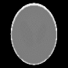

# CT Reconstruction Tutorial {#ct_reconstruction_tutorial}

This demo teaches ndl::forward_project()/ndl::back_project() (projection.h) the same way demo/convolution teaches convolve(): each step shows the code, explains it, and shows the result -- first on small numbers you can check by hand, then on a real (if synthetic) CT reconstruction problem. Output PNGs land in: build/demo/ct_reconstruction/output

## PART 1: forward_project() -- a single voxel, checked by hand

### Step 1
```cpp
forward_project(singleVoxel, sino1, geometry1)   // one voxel at the volume's own center
```

A voxel exactly at the geometry's own center of rotation projects to the SAME detector coordinate (6, the detector's own center) at every view angle -- the one case simple enough to check without a calculator.

```text
view 0 peak detector index (expect 6):   6  (value 1.000000)
view 1 peak detector index (expect 6):   6  (value 1.152322)
view 2 peak detector index (expect 6):   6  (value 1.000000)
view 3 peak detector index (expect 6):   6  (value 1.152322)
```

## PART 2: the Shepp-Logan phantom

### Step 2
```cpp
sheppLoganValue(x,y)   // ten ellipses, additive density -- see this file's own comment
```

The classic Shepp-Logan phantom (Shepp & Logan, 1974) -- the standard synthetic test image for CT reconstruction, an idealized head cross-section built from ten overlapping ellipses (some subtracting density, carving out the brain's internal structure).

[](images/ct_reconstruction_tutorial/ct_reconstruction_tutorial_01_phantom.png)

```text
Shepp-Logan phantom (ground truth): 01_phantom.png
    extent = {100, 100}   min=0  max=255  mean=68.4022
```

## PART 3: forward_project() the phantom into a sinogram

### Step 3
```cpp
forward_project(phantom, sinogram, geometry)   // 90 parallel-beam views over 180 degrees
```

Each row of 02_sinogram.png is one view's own 1D projection (a line integral through the phantom at that angle); stacking all 90 rows gives the classic sinogram -- named for the sinusoidal trace a single off-center point source (see PART 1 above, and unitTests/projection_tests.cpp's point-source test) would trace across it.

[](images/ct_reconstruction_tutorial/ct_reconstruction_tutorial_02_sinogram.png)

```text
sinogram (one row per view): 02_sinogram.png
    extent = {90, 145}   min=0  max=255  mean=94.0869
```

## PART 4: reconstructing the phantom from ONLY the sinogram

### Step 4
```cpp
recon += lambda * back_project(sinogram - forward_project(recon)); clamp to [0, max_density_bound(sinogram)]
```

Starting from an all-zero volume, repeatedly forward-project the current estimate, compare against the real sinogram, and back-project the residual to correct the estimate -- the simplest member of the ART/SART/OS-SEM family of iterative CT reconstruction algorithms real scanners use. That back_project() is forward_project()'s EXACT adjoint (projection.h's own top comment explains why -- verified directly by unitTests/projection_tests.cpp's dot-product test) is what makes this a well-behaved gradient-descent step on ||forward_project(x) - sinogram||^2, rather than an ad-hoc update rule that happens to sort of work. Each update is also CLAMPED to [0, max_density_bound(sinogram)] -- a box constraint ("projected" Landweber/gradient descent), not just a display fix. The lower bound (0) is physical: density/attenuation can't be negative. The upper bound is derived per-voxel directly from the measured sinogram itself (max_density_bound(), projection.h's own comment has the derivation) -- background voxels the sinogram shows a clear line of sight through (a near-zero ray sum at some angle) get clamped tightly near zero, which is exactly what suppresses the bright stray-pixel overshoot artifacts unconstrained Landweber is otherwise prone to in the background.

```text
iteration 0:   RMSE vs. ground truth = 0.295362
iteration 10:   RMSE vs. ground truth = 0.164754
iteration 20:   RMSE vs. ground truth = 0.143705
iteration 30:   RMSE vs. ground truth = 0.130842
iteration 40:   RMSE vs. ground truth = 0.121250
iteration 50:   RMSE vs. ground truth = 0.113489
iteration 59:   RMSE vs. ground truth = 0.107569
```

[](images/ct_reconstruction_tutorial/ct_reconstruction_tutorial_03_reconstruction.png)

```text
reconstruction after 60 box-constrained Landweber iterations: 03_reconstruction.png
    extent = {100, 100}   min=0  max=255  mean=65.8801
```

All outputs written to: build/demo/ct_reconstruction/output 01 is the ground-truth phantom; 02 is its sinogram (what a real CT scanner would actually measure); 03 is the reconstruction recovered from ONLY that sinogram, via forward_project()/ back_project() alone (plus the sinogram-derived box constraint described above) -- compare 03 against 01 to judge reconstruction quality, and the RMSE numbers above to see it decrease monotonically as the iteration progresses.

