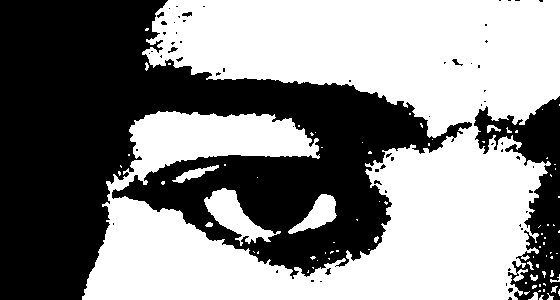
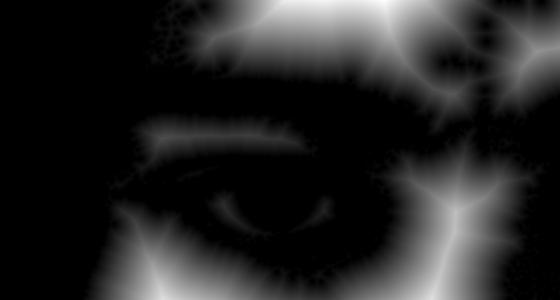

# Distance Transform Tutorial {#distance_transform_tutorial}

This demo teaches ndl::distance_transform()/distance_transform_squared() the same way demo/convolution teaches convolve(): each step shows the code, explains it, and shows the result -- first on small numbers you can check by hand, then on a real photo whose results you check by *looking at the saved PNG*. Output PNGs land in: /home/nathanpackard/git/ndl/build/demo/distance_transform/output

## PART 1: distance_transform() on a 1D row

### Step 1
```cpp
distance_transform(row, dist)
```

distance_transform(src, dst) writes, at every position, the (true Euclidean) distance to the nearest position where src is false/zero -- the same convention OpenCV's own distanceTransform() uses: a false/background pixel is trivially distance 0, and distance grows the deeper into a run of true/foreground pixels you go. Reading `row` by hand: positions 0,4,7 are false (distance 0); position 1 is 1 step from position 0; position 2 is 2 steps from either false neighbor; and so on.

```text
    row (1=foreground):
0.00, 1.00, 1.00, 1.00, 0.00, 1.00, 1.00, 0.00, 1.00, 1.00, 
    dist:
0.00, 1.00, 2.00, 1.00, 0.00, 1.00, 1.00, 0.00, 1.00, 2.00, 
```

### Step 2
```cpp
distance_transform_squared(row, distSq)
```

The squared version skips the final sqrt() -- exact, and often what you actually want if you're only ever going to compare distances against each other or against a squared threshold, since sqrt is both extra work and (for non-perfect-square results) where floating-point rounding first enters the picture. distance_transform() itself is just this plus one elementwise sqrt pass.

```text
    distSq:
0.00, 1.00, 4.00, 1.00, 0.00, 1.00, 1.00, 0.00, 1.00, 4.00, 
```

## PART 2: a 2D grid, and distance-to-foreground via invert()

### Step 3
```cpp
distance_transform(grid, gridDist)   // one foreground point at the center
```

A single foreground point at (2,2), everything else background: the distance transform's own convention (distance to nearest BACKGROUND pixel) means every position except (2,2) itself reads 0 here, since (2,2)'s immediate neighbors are already background -- the single foreground point is 1 step from a background pixel in every direction, so gridDist(2,2) should read exactly 1.

```text
    grid:
0.00, 0.00, 0.00, 0.00, 0.00, 
0.00, 0.00, 0.00, 0.00, 0.00, 
0.00, 0.00, 1.00, 0.00, 0.00, 
0.00, 0.00, 0.00, 0.00, 0.00, 
0.00, 0.00, 0.00, 0.00, 0.00, 
```

```text
    gridDist:
0.00, 0.00, 0.00, 0.00, 0.00, 
0.00, 0.00, 0.00, 0.00, 0.00, 
0.00, 0.00, 1.00, 0.00, 0.00, 
0.00, 0.00, 0.00, 0.00, 0.00, 
0.00, 0.00, 0.00, 0.00, 0.00, 
```

### Step 4
```cpp
ndl::invert(grid, invertedGrid); distance_transform(invertedGrid, distToForeground);
```

Want distance to the nearest FOREGROUND pixel instead? distance_transform.h doesn't need its own separate flag for that -- invert() (morphology.h) flips the source first, so 'nearest background pixel of the inverted image' becomes 'nearest foreground pixel of the original'. Now every position reads its Chebyshev-flavored distance to (2,2) -- the corners (distance^2 = 2^2+2^2 = 8, i.e. distance ~2.83) should read the largest values, and (2,2) itself reads exactly 0.

```text
    distToForeground:
2.83, 2.24, 2.00, 2.24, 2.83, 
2.24, 1.41, 1.00, 1.41, 2.24, 
2.00, 1.00, 0.00, 1.00, 2.00, 
2.24, 1.41, 1.00, 1.41, 2.24, 
2.83, 2.24, 2.00, 2.24, 2.83, 
```

## PART 3: a real photo

```text
Opening the input file: /home/nathanpackard/git/ndl/demo/distance_transform/../../unitTests/data/ng_bwgirl_crop.jpg.
width: 560
height: 300
width * height: 168000
size: 504000
```

[](images/distance_transform_tutorial/distance_transform_tutorial_01_original.png)

```text
photo: /home/nathanpackard/git/ndl/build/demo/distance_transform/output/01_original.png
    extent = {3, 560, 300}   min=0  max=255  mean=121.08
```

### Step 5
```cpp
gaussian_blur(grey, greySmooth, 1.5, BorderMode::Clamp)
```

grey is a real scanned photo, so it carries real film-grain noise -- fine, speckled variation baked into every pixel, the Gaussian-sensor-noise case demo/morphology's Part 4 contrasts against salt-and-pepper (median_filter() territory): a gaussian_blur() is the right tool for grain like this, not median_filter(), since the corruption is already a small continuous jitter rather than isolated 0/255 outliers. Skipping this step and thresholding grey directly would carry that per-pixel jitter straight through otsu_threshold()'s single global cutoff, speckling the binary mask -- and, further downstream, distance_transform() reads every one of those stray flipped pixels as its own tiny island of foreground/background, fracturing what should be one smooth distance field into a field full of tiny local maxima.

### Step 6
```cpp
uint8_t t = otsu_threshold(greySmooth); threshold(greySmooth, maskU8, t, 1, 0);
```

distance_transform() needs a binary-ish source, so the smoothed greyscale photo is thresholded -- otsu_threshold() (morphology.h, Histogram<1>-backed, see demo/histogram) picks the cutoff automatically, the same way demo/morphology's Part 7 does.

[](images/distance_transform_tutorial/distance_transform_tutorial_02_mask.png)

```text
binary mask (smoothed, then otsu-thresholded): /home/nathanpackard/git/ndl/build/demo/distance_transform/output/02_mask.png
    extent = {560, 300}   min=0  max=255  mean=137.21
```

### Step 7
```cpp
distance_transform(maskU8, dt)   // distance to the nearest background (0) pixel
```

distance_transform()'s source doesn't need to literally be bool -- any arithmetic value_type works, nonzero read as foreground (the same convention convolve()'s kernel taps and threshold()'s own onValue/offValue already use), so maskU8's 0/1 values feed straight in with no conversion. Every background (0) pixel is trivially 0, and foreground (1) pixels grow brighter the deeper inside a bright blob they are. Saved with 0 mapped to black and the field's own maximum mapped to white, so 03_distance.png should look like a soft, glowing version of 02_mask.png's white regions.

```text
max distance found:   86.539009
```

[](images/distance_transform_tutorial/distance_transform_tutorial_03_distance.png)

```text
distance field (0=black, max=white): /home/nathanpackard/git/ndl/build/demo/distance_transform/output/03_distance.png
    extent = {560, 300}   min=0  max=255  mean=36.87
```

All outputs written to: /home/nathanpackard/git/ndl/build/demo/distance_transform/output 01 is the original photo. 02 is its (smoothed first, then) Otsu-thresholded binary mask -- smoothing away the photo's own film grain before thresholding is what keeps this mask free of the stray single-pixel speckling that grain would otherwise punch through a raw threshold. 03 is the distance transform of that mask, visualized as greyscale -- it should look like a soft glow filling the interior of 02's bright regions, brightest at each region's own 'deepest' point (its approximate medial axis) and fading smoothly to black at every edge, not fractured by grain-sized local maxima.

