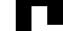
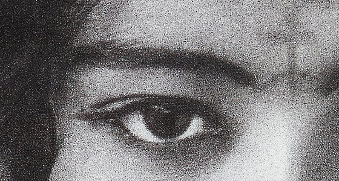
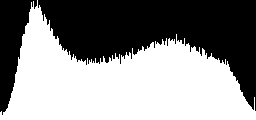
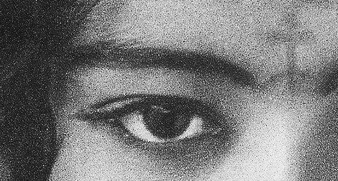
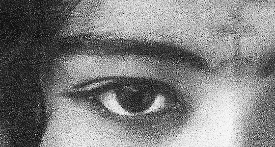
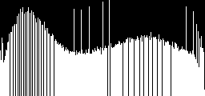
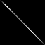

# Histogram Tutorial {#histogram_tutorial}

This demo teaches ndl::Histogram<VDIM> and ndl::histogram_equalize() the same way demo/convolution teaches convolve(): each step shows the code, explains it, and shows the result -- first on small numbers you can check by hand, then on a real photo whose results you check by *looking at the saved PNGs*, the histograms themselves included (histogram_image(), a real bar chart or heatmap, not ASCII). Output PNGs land in: /home/nathanpackard/git/ndl/build/demo/histogram/output

## PART 1: how Histogram<1> works

### Step 1
```cpp
Histogram<1> hist(small, 4)   // 10 values, range [1,9], 4 bins
```

Histogram<VDIM> bins the joint distribution of VDIM co-occurring scalar values -- VDIM==1 is the ordinary single-channel histogram used here. lo()/hi() auto-range from small's own [min,max] (1 and 9), split into 4 equal-width buckets: [1,3), [3,5), [5,7), [7,9] (the last bucket closed-inclusive at hi, same convention otsu_threshold() below relies on). Reading off `small`: three 1s and two 2s land in bucket 0 (5 total), zero values land in bucket 1, four 5s land in bucket 2, and the single 9 lands in bucket 3 (closed-inclusive at hi, not one past it).

```text
total():   10  (expected 10)
lo() / hi():   1.000000 / 9.000000
count(0), count(1), count(2), count(3):   5, 0, 4, 1  (expected 5, 0, 4, 1)
```

### Step 2
```cpp
showArray("hist", hist)   // operator<< prints one ASCII bar per bin
```

Every Histogram<1> can be printed directly, the same way Image itself can (image/print.h) -- here it's a horizontal bar per bin instead of a grid of values, scaled so the tallest bin's bar spans a fixed width. Only used here, on this small a histogram (4 bins) -- see histogram_image() just below for how the rest of this demo shows one at real-photo scale instead.

```text
hist:
   1.0 -        3.0 | ################################################## 5
   3.0 -        5.0 |  0
   5.0 -        7.0 | ######################################## 4
   7.0 -        9.0 | ########## 1
```

### Step 3
```cpp
histogram_image(hist, dst, 255, 0)
```

The same Histogram<1>, rendered as an actual image instead of text: bar_chart() (visualize.h) draws one vertical bar per bin, scaled to the tallest bin, and histogram_image() is a thin dispatch straight to it -- hist.counts() is already a real minimal-interface image (an OwnedImage<std::size_t,1>), so there's no Histogram-specific drawing code at all. 00_small_hist.png should show 4 bars: short, none, tall, and a short one, matching count(0..3) = 5, 0, 4, 1 above.



```text
small histogram, as an image: /home/nathanpackard/git/ndl/build/demo/histogram/output/00_small_hist.png
    extent = {3, 80, 40}   min=0  max=255  mean=127.5
```

### Step 4
```cpp
uint8_t t = otsu_threshold(small)   // otsu_threshold() is Histogram<1>-backed now
```

morphology.h's otsu_threshold() builds exactly this Histogram<1> internally (see its own comment) instead of a hand-rolled bin array -- same algorithm, same answer, just sharing this class instead of duplicating its own copy of the bucketing logic.

```text
otsu_threshold(small):   2
```

## PART 2: a real photo's histogram

```text
Opening the input file: /home/nathanpackard/git/ndl/demo/histogram/../../unitTests/data/ng_bwgirl_crop.jpg.
width: 560
height: 300
width * height: 168000
size: 504000
```



```text
photo: /home/nathanpackard/git/ndl/build/demo/histogram/output/01_original.png
    extent = {3, 560, 300}   min=0  max=255  mean=121.076
```

### Step 5
```cpp
Histogram<1> photoHist(grey);   // default 256 bins -- no reason to coarsen it now that it's an image, not ASCII
```

The same Histogram<1>, now over a real photo's greyscale values, at the default 256-bin resolution -- unlike an ASCII bar chart (one line per bin), an image has no reason to coarsen the resolution just to keep it readable.



```text
photo histogram: /home/nathanpackard/git/ndl/build/demo/histogram/output/02_photo_histogram.png
    extent = {3, 256, 120}   min=0  max=255  mean=137.801
```

## PART 3: histogram_equalize()

### Step 6
```cpp
histogram_equalize(grey, equalized)
```

Remaps grey's values so their cumulative distribution is closer to uniform across its own [min,max] range -- the classic contrast-stretching operation for a photo whose values cluster in a narrow sub-range instead of using the full range. Compare 03_grey_original.png (the unequalized greyscale photo) against 04_equalized.png, and the two histogram images below: the equalized one should look visibly flatter/more spread out across its bins than the original's, which likely has a few tall spikes.



```text
grey (unequalized): /home/nathanpackard/git/ndl/build/demo/histogram/output/03_grey_original.png
    extent = {1, 560, 300}   min=0  max=255  mean=120.765
```



```text
equalized: /home/nathanpackard/git/ndl/build/demo/histogram/output/04_equalized.png
    extent = {1, 560, 300}   min=0  max=255  mean=127.585
```



```text
equalized histogram: /home/nathanpackard/git/ndl/build/demo/histogram/output/05_equalized_histogram.png
    extent = {3, 256, 120}   min=0  max=255  mean=127.965
```

## PART 4: joint histograms (Histogram<2>)

### Step 7
```cpp
Histogram<2> joint({64,64}, {&redChannel, &greenChannel});   histogram_image(joint, dst, 255)
```

Histogram<VDIM> generalizes over VDIM the same way Image<T,DIM> generalizes over spatial dimension DIM: VDIM is the number of *value* axes being jointly binned, independent of the source images' own spatial dimensionality. Here VDIM=2 bins the joint distribution of the red and green channels' values at each pixel -- a classic co-occurrence/texture-analysis tool. histogram_image() dispatches to heatmap() (visualize.h) instead of bar_chart() for VDIM==2 -- same idea, same underlying 'scale to max, write into dst' shape, just one image pixel per bin instead of one bar. A natural photo's red/green channels are strongly correlated, so 06_joint_histogram.png's brightest pixels should cluster near the diagonal.

```text
joint.total():   168000  (expected: one per pixel)
```



```text
joint red/green histogram: /home/nathanpackard/git/ndl/build/demo/histogram/output/06_joint_histogram.png
    extent = {3, 64, 64}   min=0  max=255  mean=4.41357
```

All outputs written to: /home/nathanpackard/git/ndl/build/demo/histogram/output 00 is a tiny hand-checkable bar chart -- 4 bars matching count(0..3) = 5,0,4,1 from Part 1. 01 is the original photo. 02 is its greyscale histogram. 03/04 are the greyscale photo before/after histogram_equalize(), and 05 is the equalized histogram -- it should look visibly flatter than 02. 06 is the joint red/green distribution across every pixel as a heatmap -- brighter pixels mark (red,green) value combinations that occur more often in this photo, and should cluster near the diagonal for a natural photo (red and green tend to rise and fall together).

