# Morphology Tutorial {#morphology_tutorial}

This demo teaches ndl::erode()/ndl::dilate()/ndl::median_filter()/ndl::percentile_filter() the same way demo/convolution teaches convolve(): each step shows the code, explains it, and shows the result -- first on small numbers you can check by hand, then on real images whose results you check by *looking at the saved PNG*. Output PNGs land in: /home/nathanpackard/git/ndl/build/demo/morphology/output

## PART 1: how erode()/dilate()/median_filter() work

### Step 1
```cpp
Image<int,2> grid(data, {5,5});  ... fill 1..25
```

The same 5x5 grid demo/convolution's Part 1 used. erode()/dilate()/median_filter() all compute one output value per input position from a neighborhood around it, same as convolve() -- they just combine the neighborhood differently.

```text
    grid:
 1.00,  2.00,  3.00,  4.00,  5.00, 
 6.00,  7.00,  8.00,  9.00, 10.00, 
11.00, 12.00, 13.00, 14.00, 15.00, 
16.00, 17.00, 18.00, 19.00, 20.00, 
21.00, 22.00, 23.00, 24.00, 25.00, 
```

### Step 2
```cpp
make_box_kernel(box3); make_cross_kernel(cross3);   // both 3x3
```

Two structuring-element shapes, built once and reused below for both morphology and (later) convolve(): make_box_kernel() marks every tap 1 (the full 3x3 neighborhood); make_cross_kernel() marks only the center and the 4 taps that vary along exactly one axis -- a plus sign. Both are ordinary kernel Images: nonzero = included, same convention convolve() already uses.

```text
    box3:
1.00, 1.00, 1.00, 
1.00, 1.00, 1.00, 
1.00, 1.00, 1.00, 
```

```text
    cross3:
0.00, 1.00, 0.00, 
1.00, 1.00, 1.00, 
0.00, 1.00, 0.00, 
```

### Step 3
```cpp
ndl::erode(grid, out1, box3)
```

erode() replaces each value with the MINIMUM of its neighborhood -- out1(2,2) should be the smallest of the 3x3 block around grid's center (7,8,9,12,13,14,17,18,19): 7. Bright regions shrink, dark regions grow -- the classic morphological reading.

```text
    out1 (box erode):
 1.00,  1.00,  2.00,  3.00,  4.00, 
 1.00,  1.00,  2.00,  3.00,  4.00, 
 6.00,  6.00,  7.00,  8.00,  9.00, 
11.00, 11.00, 12.00, 13.00, 14.00, 
16.00, 16.00, 17.00, 18.00, 19.00, 
```

```text
out1(2,2):   7  (expected 7)
```

### Step 4
```cpp
ndl::dilate(grid, out1, box3)
```

dilate() is the mirror image: the MAXIMUM of the neighborhood. out1(2,2) should be 19, the largest of that same 3x3 block.

```text
    out1 (box dilate):
 7.00,  8.00,  9.00, 10.00, 10.00, 
12.00, 13.00, 14.00, 15.00, 15.00, 
17.00, 18.00, 19.00, 20.00, 20.00, 
22.00, 23.00, 24.00, 25.00, 25.00, 
22.00, 23.00, 24.00, 25.00, 25.00, 
```

```text
out1(2,2):   19  (expected 19)
```

### Step 5
```cpp
ndl::median_filter(grid, out1, box3)   // == ndl::percentile_filter(grid, out1, box3, 50.0)
```

The middle value of the sorted 3x3 neighborhood (1,7,8,9,12,13,14,17,18,19 minus the one that isn't included -- 9 values, so the 5th) -- 13, the same value the center already held here, since this grid has no outliers. median_filter() only gets interesting on noisy data, which Part 3 below gets to.

```text
    out1 (median):
 2.00,  3.00,  4.00,  5.00,  5.00, 
 6.00,  7.00,  8.00,  9.00, 10.00, 
11.00, 12.00, 13.00, 14.00, 15.00, 
16.00, 17.00, 18.00, 19.00, 20.00, 
21.00, 21.00, 22.00, 23.00, 24.00, 
```

```text
out1(2,2):   13  (expected 13)
```

### Step 6
```cpp
ndl::erode(grid, out1, cross3) vs ndl::erode(grid, out1, box3)   // shape changes the answer
```

Swapping the box for the cross changes which 5 values (not 9) are considered: only 8,12,13,14,18 (center plus its 4-neighbors) -- so out1(2,2) is still checkable by hand, but from a smaller, differently-shaped set.

```text
out1(2,2) with cross3:   8  (expected 8, min of 8,12,13,14,18)
out1(2,2) with cross3:   18  (expected 18, max of 8,12,13,14,18)
```

## PART 2: box vs cross, made visible

### Step 7
```cpp
ndl::dilate(dot, boxGrown, box5) vs ndl::dilate(dot, crossGrown, cross5)   // radius-2 kernels
```

Dilating a single 1-pixel dot with a structuring element traces out that element's own shape exactly (same idea as demo/convolution's impulse-response step for gaussian_blur() -- the dilation of one point by a shape is just that shape, translated to the point): a box grows the dot into a solid 5x5 SQUARE, a cross grows it into a thin 5-long PLUS SIGN, not a filled diamond -- only the 4 axis arms turn on, the diagonal-adjacent cells stay 0, printed below side by side.

```text
    boxGrown (square):
0.00, 0.00, 0.00, 0.00, 0.00, 0.00, 0.00, 0.00, 0.00, 0.00, 0.00, 
0.00, 0.00, 0.00, 0.00, 0.00, 0.00, 0.00, 0.00, 0.00, 0.00, 0.00, 
0.00, 0.00, 0.00, 0.00, 0.00, 0.00, 0.00, 0.00, 0.00, 0.00, 0.00, 
0.00, 0.00, 0.00, 1.00, 1.00, 1.00, 1.00, 1.00, 0.00, 0.00, 0.00, 
0.00, 0.00, 0.00, 1.00, 1.00, 1.00, 1.00, 1.00, 0.00, 0.00, 0.00, 
0.00, 0.00, 0.00, 1.00, 1.00, 1.00, 1.00, 1.00, 0.00, 0.00, 0.00, 
0.00, 0.00, 0.00, 1.00, 1.00, 1.00, 1.00, 1.00, 0.00, 0.00, 0.00, 
0.00, 0.00, 0.00, 1.00, 1.00, 1.00, 1.00, 1.00, 0.00, 0.00, 0.00, 
0.00, 0.00, 0.00, 0.00, 0.00, 0.00, 0.00, 0.00, 0.00, 0.00, 0.00, 
0.00, 0.00, 0.00, 0.00, 0.00, 0.00, 0.00, 0.00, 0.00, 0.00, 0.00, 
0.00, 0.00, 0.00, 0.00, 0.00, 0.00, 0.00, 0.00, 0.00, 0.00, 0.00, 
```

```text
    crossGrown (plus sign):
0.00, 0.00, 0.00, 0.00, 0.00, 0.00, 0.00, 0.00, 0.00, 0.00, 0.00, 
0.00, 0.00, 0.00, 0.00, 0.00, 0.00, 0.00, 0.00, 0.00, 0.00, 0.00, 
0.00, 0.00, 0.00, 0.00, 0.00, 0.00, 0.00, 0.00, 0.00, 0.00, 0.00, 
0.00, 0.00, 0.00, 0.00, 0.00, 1.00, 0.00, 0.00, 0.00, 0.00, 0.00, 
0.00, 0.00, 0.00, 0.00, 0.00, 1.00, 0.00, 0.00, 0.00, 0.00, 0.00, 
0.00, 0.00, 0.00, 1.00, 1.00, 1.00, 1.00, 1.00, 0.00, 0.00, 0.00, 
0.00, 0.00, 0.00, 0.00, 0.00, 1.00, 0.00, 0.00, 0.00, 0.00, 0.00, 
0.00, 0.00, 0.00, 0.00, 0.00, 1.00, 0.00, 0.00, 0.00, 0.00, 0.00, 
0.00, 0.00, 0.00, 0.00, 0.00, 0.00, 0.00, 0.00, 0.00, 0.00, 0.00, 
0.00, 0.00, 0.00, 0.00, 0.00, 0.00, 0.00, 0.00, 0.00, 0.00, 0.00, 
0.00, 0.00, 0.00, 0.00, 0.00, 0.00, 0.00, 0.00, 0.00, 0.00, 0.00, 
```

## PART 3: erode/dilate on a real photo


```text
marbles: /home/nathanpackard/git/ndl/build/demo/morphology/output/01_original.png
    extent = {3, 710, 501}   min=0  max=254  mean=120.81
```

### Step 8
```cpp
erodeColor(marbles, box5, eroded, BorderMode::Clamp)
```

erode() on a real photo shrinks bright regions and thickens dark ones -- the bright highlights on each marble should visibly shrink, and the dark gaps between marbles should visibly thicken.

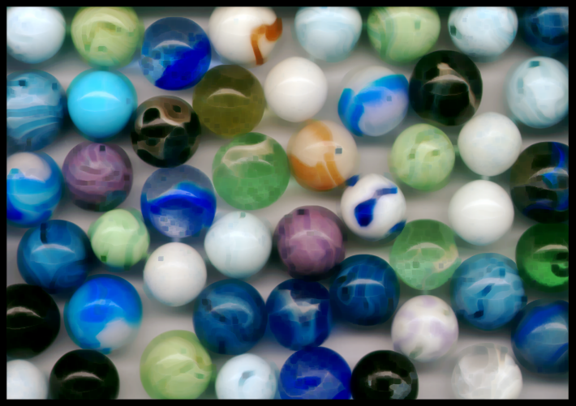

```text
eroded: /home/nathanpackard/git/ndl/build/demo/morphology/output/02_eroded.png
    extent = {3, 710, 501}   min=0  max=254  mean=105.98
```

### Step 9
```cpp
dilateColor(marbles, box5, dilated, BorderMode::Clamp)
```

The mirror image: bright regions grow, dark regions shrink -- compare 02_eroded.png and 03_dilated.png against 01_original.png side by side.

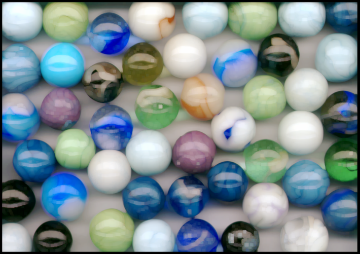

```text
dilated: /home/nathanpackard/git/ndl/build/demo/morphology/output/03_dilated.png
    extent = {3, 710, 501}   min=0  max=254  mean=135.90
```

## PART 4: median_filter vs gaussian_blur on noisy data


```text
crop: /home/nathanpackard/git/ndl/build/demo/morphology/output/04_crop.png
    extent = {3, 256, 256}   min=0  max=254  mean=128.14
```

### Step 10
```cpp
addSaltAndPepperNoise(crop, noisy, 0.05)   // 5% of pixels forced to pure black or white
```

Salt-and-pepper noise -- scattered pixels forced to 0 or 255, nothing in between -- is the specific corruption median_filter() (unlike gaussian_blur()) is good at removing, because its output is always one of the surviving nearby pixel values, never an average that a single extreme outlier can drag toward itself.

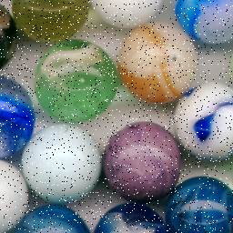

```text
noisy: /home/nathanpackard/git/ndl/build/demo/morphology/output/05_noisy.png
    extent = {3, 256, 256}   min=0  max=255  mean=128.12
```

### Step 11
```cpp
medianColor(noisy, box3, medianCleaned, BorderMode::Clamp)
```

Each noisy pixel is very likely to be outvoted by its (uncorrupted) neighbors' median, so it gets replaced outright -- edges and texture should come back looking sharp, not blurry, because every output pixel is a real pixel value from somewhere nearby, not a blend.


```text
median-cleaned: /home/nathanpackard/git/ndl/build/demo/morphology/output/06_median_cleaned.png
    extent = {3, 256, 256}   min=0  max=254  mean=128.14
```

### Step 12
```cpp
gaussianBlurColor-style: ndl::gaussian_blur(noisy.slice(0,c), ..., 1.5, BorderMode::Clamp) per channel
```

For comparison: the same noisy image run through demo/convolution's Part 3 tool instead. A gaussian blur averages every pixel with its neighbors, including the 0s and 255s -- so instead of removing the noise it smears each corrupted pixel into a soft grey/white smudge over its neighborhood, and blurs real edges at the same time. Compare 06_median_cleaned.png (sharp) against 07_gaussian_cleaned.png (smudged) directly.


```text
gaussian-cleaned: /home/nathanpackard/git/ndl/build/demo/morphology/output/07_gaussian_cleaned.png
    extent = {3, 256, 256}   min=0  max=253  mean=127.62
total |cleaned - original crop| difference, median:   171366
total |cleaned - original crop| difference, gaussian:   1190928  (lower is closer to the noise-free original)
```

## PART 5: percentile_filter()

### Step 13
```cpp
percentileColor(noisy, box3, out, p, BorderMode::Clamp)   for p in {10, 50, 90}
```

percentile_filter() generalizes all three: percentile 0 is erode() (the minimum), 100 is dilate() (the maximum), 50 is median_filter(). In between is a genuine 'soft' erode/dilate -- p=10 shrinks bright regions like erode but is more resistant to a single stray dark noise pixel, since it takes the 10th-ranked value of the neighborhood rather than the strict minimum.


```text
percentile 10 (soft erode): /home/nathanpackard/git/ndl/build/demo/morphology/output/08_percentile_10.png
    extent = {3, 256, 256}   min=0  max=254  mean=120.11
```

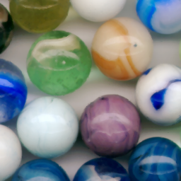

```text
percentile 50 (== median_filter): /home/nathanpackard/git/ndl/build/demo/morphology/output/09_percentile_50.png
    extent = {3, 256, 256}   min=0  max=254  mean=128.14
```


```text
percentile 90 (soft dilate): /home/nathanpackard/git/ndl/build/demo/morphology/output/10_percentile_90.png
    extent = {3, 256, 256}   min=0  max=255  mean=136.09
```

## PART 6: opening and closing

### Step 14
```cpp
erodeColor(noisy, ...) then dilateColor(..., box3, opened, ...)   -- "opening"
```

Two of the operations above, composed: erode then dilate ("opening" in the standard morphology vocabulary) removes small bright specks -- salt noise, mostly -- while letting large bright regions shrink and then grow back to roughly their original size. No new library code, just two calls in sequence.

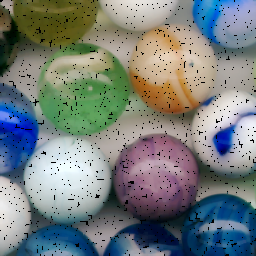

```text
opened (erode then dilate): /home/nathanpackard/git/ndl/build/demo/morphology/output/11_opened.png
    extent = {3, 256, 256}   min=0  max=254  mean=122.95
```

### Step 15
```cpp
dilateColor(noisy, ...) then erodeColor(..., box3, closed, ...)   -- "closing"
```

The other order: dilate then erode ("closing") instead fills small dark specks -- pepper noise -- while similarly restoring large regions close to their original size.


```text
closed (dilate then erode): /home/nathanpackard/git/ndl/build/demo/morphology/output/12_closed.png
    extent = {3, 256, 256}   min=0  max=255  mean=133.50
```

## PART 7: Otsu thresholding

### Step 16
```cpp
crop.mean(0, greyClean3); noisy.mean(0, greyNoisy3);   // per-axis reduction over the channel axis
```

otsu_threshold()/threshold() work on one scalar per pixel, so both the clean crop and its salt-and-pepper-corrupted copy (both already built in Part 4) are reduced to greyscale first -- same reduction demo/convolution's Sobel step used.

### Step 17
```cpp
uint8_t t = ndl::otsu_threshold(greyNoisy); ndl::threshold(greyNoisy, binaryNoisy, t, 255, 0);
```

otsu_threshold() still finds *a* split on the noisy greyscale, but the salt-and-pepper corruption pushes individual pixels across that split regardless of what's actually underneath them, so the binary result should be full of isolated stray black/white speckles rather than clean regions -- the same corruption Part 4 introduced, now breaking a *different* operation than the blur it was shown against there.

```text
otsu_threshold() on the noisy greyscale:   41
```

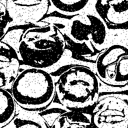

```text
binary (thresholded directly, noisy): /home/nathanpackard/git/ndl/build/demo/morphology/output/13_binary_noisy.png
    extent = {1, 256, 256}   min=0  max=255  mean=141.36
```

### Step 18
```cpp
ndl::median_filter(greyNoisy, greyDenoised, box3, Clamp);   // then ndl::otsu_threshold()
```

Denoising first (median_filter(), Part 4's own tool for this exact corruption) removes most of the salt-and-pepper noise before Otsu ever sees it, so the resulting threshold should split the image into far cleaner, more connected regions -- one pass of the same 3x3 kernel Part 4 used is enough here, since salt-and-pepper noise (unlike, say, heavy film grain) is exactly what median_filter() is good at removing outright. Compare 13_binary_noisy.png against 15_binary_denoised.png directly, and both against 14_binary_clean.png -- the Otsu result on the never-corrupted crop, the ground truth both are approximating.


```text
binary (clean crop, ground truth): /home/nathanpackard/git/ndl/build/demo/morphology/output/14_binary_clean.png
    extent = {1, 256, 256}   min=0  max=255  mean=139.80
otsu_threshold(): clean / noisy / denoised:   42 / 41 / 42
```

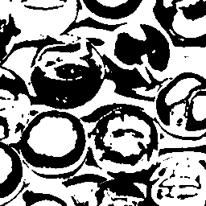

```text
binary (denoised first): /home/nathanpackard/git/ndl/build/demo/morphology/output/15_binary_denoised.png
    extent = {1, 256, 256}   min=0  max=255  mean=140.55
pixels disagreeing with the clean-crop ground truth, noisy threshold:   2165
pixels disagreeing with the clean-crop ground truth, denoised threshold:   1655  (lower is closer to the truth)
```

## PART 8: binary morphology

### Step 19
```cpp
ndl::erode(binaryDenoisedChannel, erodedBinary, box3, Clamp); ndl::dilate(binaryDenoisedChannel, dilatedBinary, box3, Clamp);
```

The same erode()/dilate() from Parts 1 and 3, now on a genuinely binary (0/255) image instead of continuous pixel data: erode() shrinks the white regions and thickens the black ones, dilate() does the opposite -- the classic "binary morphology" operations from any image processing textbook, built from the exact same two functions this demo already used on real-valued images.

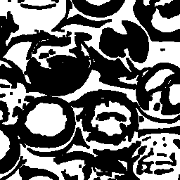

```text
binary eroded: /home/nathanpackard/git/ndl/build/demo/morphology/output/16_binary_eroded.png
    extent = {1, 256, 256}   min=0  max=255  mean=106.74
```

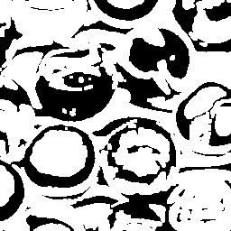

```text
binary dilated: /home/nathanpackard/git/ndl/build/demo/morphology/output/17_binary_dilated.png
    extent = {1, 256, 256}   min=0  max=255  mean=173.57
```

### Step 20
```cpp
opening/closing on the already-denoised binary image
```

One more opening/closing pass (Part 6's idea again, applied here to the ALREADY-denoised binary result) mops up whatever small speckles median_filter() didn't fully catch -- a standard real-world pipeline: denoise, threshold, then clean up the binary result with morphology.

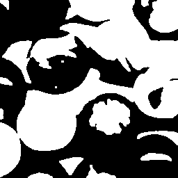

```text
binary opened: /home/nathanpackard/git/ndl/build/demo/morphology/output/18_binary_opened.png
    extent = {1, 256, 256}   min=0  max=255  mean=137.25
```

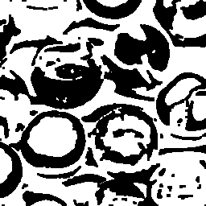

```text
binary closed: /home/nathanpackard/git/ndl/build/demo/morphology/output/19_binary_closed.png
    extent = {1, 256, 256}   min=0  max=255  mean=145.14
```

## PART 9: PackedBitImage

### Step 21
```cpp
PackedBitImage<2> packedDenoised(greyDenoised.extent()); ndl::threshold(greyDenoised, packedDenoised, tDenoised);
```

erode()/dilate()/median_filter()/threshold() are each implemented exactly once, as free functions (ndl::erode() etc., in morphology.h) written against any type exposing extent()/at()/coordinates() -- Image satisfied that from the start, and PackedBitImage (1 bit of real storage per pixel, instead of a whole byte) is built to satisfy the same contract, so the exact same calls below run against it completely unmodified, no PackedBitImage-specific code needed.

### Step 22
```cpp
ndl::erode(packedDenoised, packedEroded, box3); ndl::dilate(packedDenoised, packedDilated, box3);
```

The same box3 kernel and BorderMode::Clamp already used on binaryDenoisedChannel in Part 8 above -- erosion/dilation of a bit image reduce to AND/OR of the neighborhood, the standard definition of binary morphology. Checked below bit-for-bit against Part 8's own erodedBinaryChannel/ dilatedBinaryChannel: two independent storage representations (a byte per pixel vs. a bit per pixel), the same shared algorithm, and they should agree on every single pixel.

```text
PackedBitImage erode() vs the byte-per-pixel Image result, mismatched pixels:   0  (expected 0)
PackedBitImage dilate() vs the byte-per-pixel Image result, mismatched pixels:   0  (expected 0)
memory: Image<uint8_t,2> mask:   65536 bytes
memory: PackedBitImage:   8192 bytes (8.000000x smaller)
```

All outputs written to: /home/nathanpackard/git/ndl/build/demo/morphology/output Open 01_original.png alongside 02/03 to see bright regions shrink/grow. Open 05_noisy.png alongside 06/07 to see median_filter() remove salt-and-pepper noise cleanly where gaussian_blur() only smears it. 08/09/10 should look like a smooth progression from soft-erode to median to soft-dilate. 11/12 should look close to 05_noisy.png but with most of the speckled noise gone. 13 (thresholded directly) should look visibly speckled compared to 15 (denoised first) -- open both alongside 14, the ground-truth threshold of the never-corrupted crop. 16-19 show binary erode/dilate/opening/closing starting from 15, the cleaner of the two thresholded results. Part 9 has no new PNGs -- it reruns 16/17's erode/dilate through PackedBitImage instead and confirms the result matches exactly, at a fraction of the memory.

