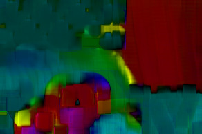
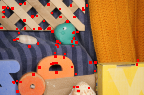
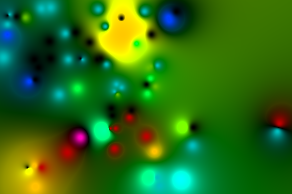

# Motion (Optical Flow / SIFT) Tutorial {#motion_tutorial}

This demo teaches ndl::lucas_kanade_flow() and ndl::sift_flow() the same way demo/convolution teaches convolve(): each step shows the code, explains it, and shows the result -- first on small numbers you can check by hand, then on a real photo pair whose results you check by *looking at the saved PNG*. Output PNGs land in: /home/nathanpackard/git/ndl/build/demo/motion/output

## PART 1: gradient() -- the building block both algorithms share

### Step 1
```cpp
gradient(ramp, grad)   // ramp(x,y) = 2x + 3y
```

gradient(src, dst) writes dst.slice(0,axis) = the central-difference partial derivative of src along that axis, for every axis -- both algorithms below build on exactly this. For the linear ramp 2x+3y, the true gradient is the constant (2,3) everywhere, so every interior position here should read exactly that.

```text
    d/dx (should be 2.00 everywhere):
1.00, 2.00, 2.00, 2.00, 2.00, 2.00, 2.00, 1.00, 
1.00, 2.00, 2.00, 2.00, 2.00, 2.00, 2.00, 1.00, 
1.00, 2.00, 2.00, 2.00, 2.00, 2.00, 2.00, 1.00, 
1.00, 2.00, 2.00, 2.00, 2.00, 2.00, 2.00, 1.00, 
1.00, 2.00, 2.00, 2.00, 2.00, 2.00, 2.00, 1.00, 
1.00, 2.00, 2.00, 2.00, 2.00, 2.00, 2.00, 1.00, 
1.00, 2.00, 2.00, 2.00, 2.00, 2.00, 2.00, 1.00, 
1.00, 2.00, 2.00, 2.00, 2.00, 2.00, 2.00, 1.00, 
```

```text
    d/dy (should be 3.00 everywhere):
1.50, 1.50, 1.50, 1.50, 1.50, 1.50, 1.50, 1.50, 
3.00, 3.00, 3.00, 3.00, 3.00, 3.00, 3.00, 3.00, 
3.00, 3.00, 3.00, 3.00, 3.00, 3.00, 3.00, 3.00, 
3.00, 3.00, 3.00, 3.00, 3.00, 3.00, 3.00, 3.00, 
3.00, 3.00, 3.00, 3.00, 3.00, 3.00, 3.00, 3.00, 
3.00, 3.00, 3.00, 3.00, 3.00, 3.00, 3.00, 3.00, 
3.00, 3.00, 3.00, 3.00, 3.00, 3.00, 3.00, 3.00, 
1.50, 1.50, 1.50, 1.50, 1.50, 1.50, 1.50, 1.50, 
```

## PART 2: lucas_kanade_flow() on a known synthetic shift

### Step 2
```cpp
lucas_kanade_flow(s0, s1, synthFlow, 7)   // s1 = s0 shifted by (1.5, -0.8)
```

A textured (not flat -- flat regions hit the aperture problem, see optical_flow.h's own comment) synthetic pattern, shifted by a known sub-pixel amount. Averaging the recovered flow over the interior (away from the border, where the window can't see a full neighborhood) should land close to the true (1.5, -0.8) shift.

```text
average recovered flow (interior):   (1.430304, -0.725022)   expected approximately (1.5, -0.8)
```

## PART 3: Lucas-Kanade on a real photo pair (RubberWhale)

### Step 3
```cpp
image_io::load_owned("rubberwhale/frame10.png"); ...frame11.png; downsample(..., 2)
```

The Middlebury RubberWhale pair (see this file's own top comment for the citation) -- downsampled 2x purely to keep this demo's saved images (and runtime -- sift_flow() below is by far the most expensive step in this whole demo) reasonable, the same reason demo/convolution/demo/morphology downsample marbles.bmp.

[](images/motion_tutorial/motion_tutorial_01_frame0.png)

```text
frame0: /home/nathanpackard/git/ndl/build/demo/motion/output/01_frame0.png
    extent = {4, 292, 194}   min=3  max=254  mean=157.46
```

[](images/motion_tutorial/motion_tutorial_02_frame1.png)

```text
frame1: /home/nathanpackard/git/ndl/build/demo/motion/output/02_frame1.png
    extent = {4, 292, 194}   min=3  max=254  mean=157.72
```

### Step 4
```cpp
lucas_kanade_flow(f0grey, f1grey, lkFlow, 9)
```

Dense, per-pixel flow -- every one of this greyscale pair's own W*H positions gets an independent estimate straight from the local gradients around it. A wider window than Part 2's (radius 9 instead of 7) trades a little spatial precision for averaging out more per-pixel noise -- this is real photo data, not a clean synthetic pattern.

### Step 5
```cpp
flow_to_color(lkFlow, lkFlowColor, 255)
```

hue = direction, brightness = magnitude (scaled to the field's own max). RubberWhale is a small sideways camera pan across a scene with real depth -- the closer foreground toys (bottom-left) and the nearer sweater (right) shift differently from the farther striped backdrop during that pan, which is exactly motion PARALLAX, not noise: 03_lk_flow_color.png should show a handful of distinct color regions -- one per rough depth layer -- rather than one single uniform hue across the whole frame.

[](images/motion_tutorial/motion_tutorial_03_lk_flow_color.png)

```text
Lucas-Kanade flow, color-coded: /home/nathanpackard/git/ndl/build/demo/motion/output/03_lk_flow_color.png
    extent = {3, 292, 194}   min=0  max=255  mean=42.58
mean flow magnitude (Lucas-Kanade):   0.665479 px
```

## PART 4: detect_keypoints() -- the scale-space part that genuinely generalizes to any DIM

### Step 6
```cpp
detect_keypoints(blobImg)   // one Gaussian blob, sigma=3, at (40,60)
```

A Difference-of-Gaussians scale-space search (feature_detection.h's own comment has the full mechanics) finds local extrema across both space AND scale -- a single clean blob should produce exactly one keypoint, right at the blob's own center, at close to the blob's own scale.

```text
keypoint:   position=(40,60)  scale=2.262742  response=33.945218   (expected near (40,60))
```

## PART 5: sift_flow() on the same real photo pair

### Step 7
```cpp
detect_keypoints()+compute_descriptors()+match_descriptors(), shown separately for the visualization below
```

sift_flow() below does all of this in one call; broken out here just so 05_sift_keypoints.png (a small dot at every matched keypoint's own frame0 position) can be saved alongside it, showing exactly WHERE this algorithm actually has information -- everywhere else in 06_sift_flow_color.png is interpolated, not measured.

```text
keypoints in frame0 / frame1:   85 / 85
matched pairs (nearest-neighbor + Lowe's ratio test):   74
```

[](images/motion_tutorial/motion_tutorial_05_sift_keypoints.png)

```text
frame0 with matched keypoints marked in red: /home/nathanpackard/git/ndl/build/demo/motion/output/05_sift_keypoints.png
    extent = {4, 292, 194}   min=0  max=255  mean=156.60
```

### Step 8
```cpp
sift_flow(f0grey, f1grey, siftFlow)
```

Propagates those sparse matched displacements to a dense per-pixel field via inverse- distance-weighted interpolation (feature_detection.h's own comment has the details) -- 06_sift_flow_color.png should be broadly similar in hue to 03_lk_flow_color.png (both are measuring the same real motion) but visibly smoother/blockier, since it's interpolated from 74 points rather than measured at every pixel independently.

### Step 9
```cpp
flow_to_color(siftFlow, siftFlowColor, 255, magnitudeCap)   // magnitudeCap = 95th percentile magnitude
```

flow_to_color()'s default "scale brightness to the field's own true max magnitude" is exactly the failure mode windowed_heatmap() (visualize.h) exists to avoid: a single stray match -- interpolated across a wide area by sift_flow()'s own inverse-distance weighting, see above -- can produce one wildly large displacement that dwarfs every real one, crushing the rest of the field to near-black. Capping brightness at the 95th percentile magnitude instead (that one outlier simply saturates at full brightness) keeps the real motion visible; percentile() is the same building block windowed_heatmap() itself uses.

```text
95th-percentile flow magnitude (used as the color-coding cap):   1.331241 px
```

[](images/motion_tutorial/motion_tutorial_06_sift_flow_color.png)

```text
SIFT-inspired flow, color-coded (95th-percentile-capped): /home/nathanpackard/git/ndl/build/demo/motion/output/06_sift_flow_color.png
    extent = {3, 292, 194}   min=0  max=255  mean=57.98
```

## PART 6: comparing the two flow fields, and the 2D complex representation

### Step 10
```cpp
average per-pixel Euclidean distance between lkFlow and siftFlow
```

Both are estimating the same real underlying motion two completely independent ways -- they should agree reasonably well on average, even though sift_flow()'s own smoothing/interpolation keeps them from matching exactly pixel-for-pixel.

```text
mean |lucas_kanade_flow - sift_flow|:   0.822362 px
```

### Step 11
```cpp
to_complex(lkFlow, lkFlowComplex); std::abs(...)/std::arg(...)
```

The general {2,W,H} representation converted to Image<std::complex<double>,2> -- once there, a flow vector's magnitude/direction are just std::abs()/std::arg() away, and rotating every vector in the field by a fixed angle is a single complex multiply, not a per-component trig rewrite. Shown here on the flow field's own strongest-motion pixel.

```text
strongest-motion pixel:   (26,175)  magnitude=1.961985px  angle=-113.392009 degrees
```

All outputs written to: /home/nathanpackard/git/ndl/build/demo/motion/output 01/02 are the two RubberWhale frames. 03 is Lucas-Kanade's dense flow, color-coded (hue= direction, brightness=magnitude). 05 marks every matched SIFT-inspired keypoint in red on frame0 -- compare its sparse dots against 06, the same color-coded visualization built by interpolating from just those points. 03 and 06 should broadly agree in hue (same real motion, two independent methods) while 06 looks visibly smoother/blockier -- exactly the dense-vs-sparse tradeoff this demo set out to show.

