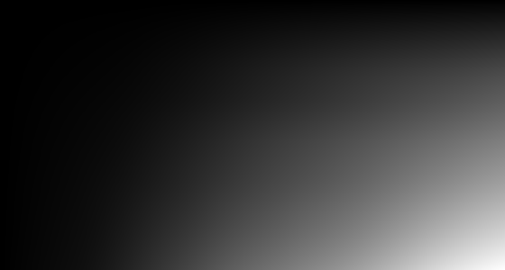
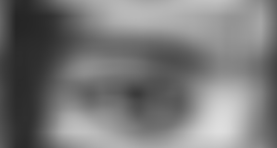

# Summed-Area Table Tutorial {#summed_area_table_tutorial}

This demo teaches ndl::summed_area_table()/rectangle_sum() the same way demo/convolution teaches convolve(): each step shows the code, explains it, and shows the result -- first on small numbers you can check by hand, then on a real photo whose results you check by *looking at the saved PNG* and the printed numbers. Output PNGs land in: /home/nathanpackard/git/ndl/build/demo/summed_area_table/output

## PART 1: summed_area_table() on a 1D row

### Step 1
```cpp
summed_area_table(row, table)
```

summed_area_table(src, dst) writes, at every position, the RUNNING SUM of every src value from the start up to and including that position -- table(i) = row(0)+...+row(i). Reading `row` by hand: 1, 1+2=3, 3+3=6, 6+4=10, 10+5=15.

```text
    row:
1.00, 2.00, 3.00, 4.00, 5.00, 
    table:
 1.00,  3.00,  6.00, 10.00, 15.00, 
```

### Step 2
```cpp
rectangle_sum(table, {1}, {3})   // sum of row[1..3] = 2+3+4
```

Once built, rectangle_sum() answers 'what's the sum over this range' in O(1) -- just a couple of lookups into table -- instead of the O(range size) a direct sum would cost every time. In 1D that's simply table(hi) - table(lo-1); rectangle_sum() generalizes the same idea to any DIM via inclusion-exclusion over the table's own corners.

```text
rectangle_sum(table, {1}, {3}):   9  (expected 2+3+4=9)
```

## PART 2: 2D, checked against a direct sum

```text
    grid:
 1.00,  2.00,  3.00,  4.00,  5.00, 
 6.00,  7.00,  8.00,  9.00, 10.00, 
11.00, 12.00, 13.00, 14.00, 15.00, 
16.00, 17.00, 18.00, 19.00, 20.00, 
21.00, 22.00, 23.00, 24.00, 25.00, 
```

```text
   grid2DTable:
 1.00,   3.00,   6.00,  10.00,  15.00, 
 7.00,  16.00,  27.00,  40.00,  55.00, 
18.00,  39.00,  63.00,  90.00, 120.00, 
34.00,  72.00, 114.00, 160.00, 210.00, 
55.00, 115.00, 180.00, 250.00, 325.00, 
```

### Step 3
```cpp
rectangle_sum(grid2DTable, {1,1}, {3,3})   // the interior 3x3 block
```

The same interior 3x3 block Part 1 of demo/convolution sums by hand for its own sumKernel example: rows y=1..3, columns x=1..3 -> 7,8,9,12,13,14,17,18,19, summing to 117.

```text
rectangle_sum result:   117  (expected 117)
direct brute-force sum, for comparison:   117
```

## PART 3: a real photo

```text
Opening the input file: /home/nathanpackard/git/ndl/demo/summed_area_table/../../unitTests/data/ng_bwgirl_crop.jpg.
width: 560
height: 300
width * height: 168000
size: 504000
```

[](images/summed_area_table_tutorial/summed_area_table_tutorial_01_original.png)

```text
photo: /home/nathanpackard/git/ndl/build/demo/summed_area_table/output/01_original.png
    extent = {3, 560, 300}   min=0  max=255  mean=121.08
```

### Step 4
```cpp
summed_area_table(grey, greyTable)   // widened to double so a full-image sum can't overflow
```

grey is uint8_t (max 255 per pixel); summing every pixel in even a modest photo overflows uint8_t immediately, so the destination is a wider type instead -- double here, though any sufficiently wide integer type (e.g. std::int64_t) works too. src and dst are independently typed on purpose for exactly this reason, unlike convolve()/erode()/etc.

```text
full-image sum (table's own last corner):   20288470.000000
```

### Step 5
```cpp
heatmap(greyTable, dst, 255)   // the table itself, rendered as an image
```

What does a summed-area table actually look like? heatmap() (visualize.h) renders any 2D minimal-interface numeric array as greyscale, scaled to the array's own max value -- the same tool histogram_image() is built on. Unlike grey itself (light/dark following the photo's own content), every value here is a RUNNING SUM of everything above and to the left of it, so the table only ever grows moving right or down: 02_sat_heatmap.png should look almost black in the top-left corner (barely anything summed in yet) and brighten smoothly toward solid white at the bottom-right corner (the full-image sum printed just above) -- a cumulative brightness map, not a picture of the photo itself.

[](images/summed_area_table_tutorial/summed_area_table_tutorial_02_sat_heatmap.png)

```text
summed-area table (0=barely summed, white=full running sum): /home/nathanpackard/git/ndl/build/demo/summed_area_table/output/02_sat_heatmap.png
    extent = {560, 300}   min=0  max=255  mean=51.57
```

### Step 6
```cpp
200 random rectangle_sum() queries vs. direct brute-force sums
```

Correctness check on real (not hand-picked) data: random rectangles, compared against directly summing every pixel in each one by brute force.

```text
mismatches out of 200 random rectangles:   0  (expected 0)
```

## PART 4: O(1) box blur vs. convolve(), at growing kernel sizes

### Step 7
```cpp
box_blur(grey, out, radius, BorderMode::Wrap)   vs.   convolve(grey, kernel, out, Wrap)
```

convolve()'s cost scales with kernel size (every output pixel visits every kernel tap, (2*radius+1)^2 of them); box_blur()'s cost per pixel is always exactly one rectangle_sum() call -- 4 table lookups -- no matter how large radius gets, the same 'pay once, query cheaply' trade fftn() makes for repeated convolutions demo/convolution's own Part 6 times against spatial convolve(). Both are given the same BorderMode::Wrap here, so unlike a border-naive summed-area-table box blur (which would need to skip or fudge the border pixels its window can't fully reach), these two should now match pixel-for-pixel everywhere, border included -- checked below, not just eyeballed. The timings are the actual point.

```text
radius=2 (5x5 kernel):   SAT box blur 5.561679 ms   vs   convolve() 12.088536 ms
radius=8 (17x17 kernel):   SAT box blur 5.156909 ms   vs   convolve() 127.081720 ms
radius=32 (65x65 kernel):   SAT box blur 6.972719 ms   vs   convolve() 1810.584423 ms
```

[](images/summed_area_table_tutorial/summed_area_table_tutorial_03_sat_box_blur.png)

```text
SAT box blur (radius=32, BorderMode::Wrap): /home/nathanpackard/git/ndl/build/demo/summed_area_table/output/03_sat_box_blur.png
    extent = {560, 300}   min=37  max=222  mean=120.26
```

[](images/summed_area_table_tutorial/summed_area_table_tutorial_04_convolve_box_blur.png)

```text
convolve() box blur (radius=32, BorderMode::Wrap): /home/nathanpackard/git/ndl/build/demo/summed_area_table/output/04_convolve_box_blur.png
    extent = {560, 300}   min=37  max=222  mean=120.26
```

### Step 8
```cpp
count pixels where 03 and 04 differ
```

Both used the same BorderMode::Wrap this time, so with border handling now shared between them instead of just approximated, the two independently-computed blurs should agree almost everywhere, border included -- not just look similar in the interior. 'Almost' rather than 'exactly', though: box_blur() sums the whole window once (via rectangle_sum()) and divides by the area a single time, while convolve() accumulates one already-divided weight per tap -- 4225 of them, for this 65x65 kernel -- so the two floating-point sums take different rounding paths to (almost always) the same double value before each narrows to uint8_t. A handful of pixels landing right on a truncation boundary can come out ±1 apart between the two paths; that's rounding noise, not a correctness bug -- checked below by how many pixels differ, and by how much.

```text
mismatched pixels, box_blur() vs convolve() (both BorderMode::Wrap):   15 out of 168000  (expect a tiny handful, from floating-point rounding order, not 0)
largest per-pixel difference among those mismatches:   1  (expected 1 -- a rounding tie, not a real disagreement)
```

All outputs written to: /home/nathanpackard/git/ndl/build/demo/summed_area_table/output 01 is the original photo. 02 is that photo's own summed-area table, visualized directly -- a cumulative running sum, not a picture, so it should look like a smooth gradient from near-black (top-left) to white (bottom-right), nothing like 01. 03/04 are the same radius-32 box blur computed two independent ways -- both using BorderMode::Wrap, they should look pixel-for-pixel identical almost everywhere, border included (confirmed by the mismatch count just above: a tiny handful of pixels differing by exactly 1, floating-point rounding noise between two different summation orders, not a real disagreement). The timings above are the real point: convolve()'s cost should grow sharply with radius while box_blur()'s stays roughly flat.

